# Notation Vision: Making Installation/Process Flows Accessible

## The Problem

Current documentation tools show process as **linear checklists**:
```
- [ ] Step 1
- [ ] Step 2
- [ ] Step 3
```

But the **actual reality** involves:
- **Multiple actors** (Linux box, Phone, services)
- **Data movement** (files copied, configs synced)
- **Parallel processes** (tunnels, mounts, servers running simultaneously)
- **Error conditions** (what if this fails? what happens next?)
- **Interdependencies** (Step 3 only works if Step 2 succeeded)

Checklists flatten this complexity. People get lost.

## Vision: Dynamic, Visual Notation

### 1. **Flow Diagrams That Show Actors & Data**

Instead of:
```
- [ ] Copy files to phone
- [ ] Install packages
- [ ] Start server
```

Show:
```
LINUX BOX                              PHONE
   │                                    │
   ├─ Discover IP via nmcli ───────────┤
   ├─ SSH to port 8022 ────────────────→ sshd (listening)
   │                                    │
   ├─ Copy files via SCP ─────────────→ ~/secret-server/
   │                                    │
   └─ Run pip install ────────────────→ ~/secret-server/requirements.txt
                                        │
                                        └─→ [Flask installed]
                                            [cryptography installed]
                                            [Ready to run]
```

**Advantages:**
- Shows which machine does what
- Shows data crossing from one to another
- Shows state changes ("Ready to run")
- Easier for non-technical people to follow

### 2. **Checklist + Diagram Fusion**

```
PHASE 3: Deploy Code
│
├─ DIAGRAM: Show files flowing from Linux → Phone
│  
├─ COMMAND BLOCKS: Actual, copy-paste code
│  LINUX$ scp -r ~/repos/secret-server/*.py phone:~/secret-server/
│  PHONE$ ls ~/secret-server/
│
└─ VERIFICATION: Explicit success criteria
   ✓ web_server.py exists on phone
   ✓ lib/ directory exists on phone
   ✓ requirements.txt present
```

A person could follow **with minimal previous knowledge** because:
- The diagram shows intent
- The commands show execution
- The verification shows "did it work?"

### 3. **Interactive Representation (Future)**

Imagine a tool that:
- Shows the flow diagram
- Highlights current step
- Shows a "progress bar" across both machines
- Can show "if you're at this checkpoint and X failed, click here for recovery steps"
- Shows logs in context ("Here's what the server printed at step 3.2")

```
[00%]========[PHASE 3: Deploy Code]=============>[100%]

PROGRESS:
  Linux: ████████░░░░░░░░░░░ (Step 2.3 of 5)
  Phone: ███░░░░░░░░░░░░░░░░░ (Waiting for files)

DIAGRAM:
  LINUX → [copying files...] → PHONE

CURRENT COMMAND:
  scp -r ~/repos/secret-server/lib phone:~/secret-server/
  [████████░░░░ 42% transferred]

LOGS:
  [10:45:22] Connected to phone
  [10:45:24] Transferring web_server.py... OK
  [10:45:31] Transferring lib/ directory...
```

### 4. **Notation Principles**

1. **Clarity first** — A non-programmer should understand intent
2. **Multi-actor design** — Show all parties (Linux, Phone, services)
3. **Data-centric** — Draw where data flows, not just where commands run
4. **Verification built-in** — Each step shows "how to know it worked"
5. **Context preservation** — Commands stay near their diagrams
6. **Error-aware** — Include "what to do if this fails" branches

## Starting Point

The **VIRGIN_INSTALL_CHECKLIST.md** already uses primitive versions of this:

✓ ASCII flow diagrams  
✓ Explicit command blocks with LINUX$ vs PHONE$ labels  
✓ Verification steps at each checkpoint  
✓ Quick reference section  

This is a good **proof of concept**. The vision is to:

1. **Formalize the notation** — Define exact conventions for diagrams
2. **Create a template generator** — Tools that can auto-create these diagrams from structured data
3. **Build an interactive viewer** — Web or terminal-based tool that guides users through flows
4. **Document the pattern** — So other projects can use it

## Example: A Future Notation Standard

```mermaid
graph LR
    A["[LINUX] Discover IP"] -->|via nmcli| B["[PHONE] sshd running"]
    B -->|SSH connection| C["[LINUX] Mount SSHFS"]
    C -->|~/android_mnt ready| D["[LINUX] Copy files"]
    D -->|web_server.py + lib/ + db/| E["[PHONE] ~/secret-server/"]
    E -->|verify ls| F["[LINUX] Proceed to pip"]
    F -->|pip install -r| G["[PHONE] Packages installed"]
    G -->|verify python imports| H["Ready for Phase 5"]
```



(This is Mermaid syntax, which renders nicely in GitHub and many documentation tools.)

## Future Steps

1. **Formalize the notation** in a separate document (NOTATION_SPEC.md)
2. **Create validators** that check structure against diagrams
3. **Build a flow-to-markdown converter** so diagrams auto-generate checklists
4. **Design templates** for common patterns (install, upgrade, backup, recovery)

---

## Inspiration & Reference

This vision draws from:
- **UML Sequence Diagrams** — showing interactions across actors
- **Flowcharts** — showing decision paths
- **DevOps runbooks** — mixing commands with prose
- **Ansible playbooks** — structured, verifiable operations
- **Terraform plans** — "here's what will change" visualizations

The goal is to create something **simpler than all of these** but **more capable than a checklist**.

